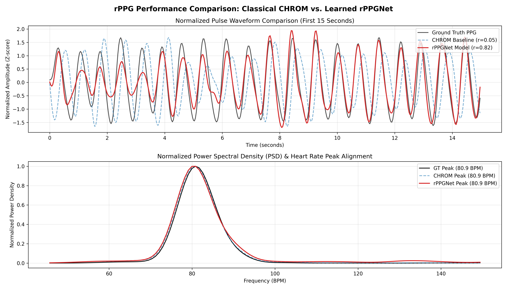

# 🫀 Remote Photoplethysmography (rPPG) — Contactless Vital Sign Monitoring

A complete pipeline for extracting contactless blood volume pulse (BVP) signals and estimating Heart Rate (BPM) from standard facial video feeds. This repository implements both **classical chrominance-based signal processing (CHROM)** and a **deep temporal attention neural network (`rPPGNet`)**.

Blood pumping through facial capillaries causes minute, sub-pixel skin color variations (~<1% intensity shift). By isolating facial skin regions (forehead and cheeks) using **MediaPipe Face Landmarker**, this project amplifies and extracts the subtle pulsatile signal to measure physiological heart rate without physical contact.

---

## 🌟 Key Features & Pipeline Overview

```
                          ┌───────────────────────────┐
                          │    Input Facial Video     │
                          └─────────────┬─────────────┘
                                        │
                                        ▼
                          ┌───────────────────────────┐
                          │  MediaPipe Face Mesh ROI  │  (468 Landmarks)
                          │   Forehead & Cheek Mask   │
                          └─────────────┬─────────────┘
                                        │
                                        ▼
                          ┌───────────────────────────┐
                          │    Per-Frame Mean RGB     │  (N, 3) Time Series
                          └─────────────┬─────────────┘
                                        │
               ┌────────────────────────┴────────────────────────┐
               ▼                                                 ▼
┌──────────────────────────────┐                ┌──────────────────────────────┐
│     Classical Baseline       │                │      Deep Learning Model     │
│   (CHROM Signal Extraction)  │                │          (`rPPGNet`)         │
│  Xs = 3R - 2G, Ys = 1.5R+G-1.5B               │  - Spatial 1D Conv Blocks    │
│  S = Xs - α * Ys             │                │  - Temporal Attention Layer  │
└──────────────┬───────────────┘                └──────────────┬───────────────┘
               │                                               │
               └────────────────────────┬──────────────────────┘
                                        │
                                        ▼
                          ┌───────────────────────────┐
                          │    Butterworth Bandpass   │  (0.75 Hz – 2.5 Hz / 45-150 BPM)
                          └─────────────┬─────────────┘
                                        │
                                        ▼
                          ┌───────────────────────────┐
                          │   Welch PSD & Peak FFT    │  Dominant Frequency → Heart Rate
                          └───────────────────────────┘
```

1. **Facial Landmark & ROI Extraction:**
   * Utilizes **MediaPipe Face Mesh (468 landmarks)** to construct dynamic, tight masks covering skin regions (forehead and cheeks).
   * Calculates frame-by-frame mean RGB color channels.
2. **Classical Chrominance Baseline (CHROM):**
   * Implements the **CHROM (Chrominance-based)** method to eliminate motion artifacts and illumination drift by taking channel ratios.
3. **Deep Learning Model (`rPPGNet`):**
   * **Spatial 1D CNN:** Extract spatiotemporal feature maps from windowed RGB signals.
   * **Temporal Attention:** Dynamically computes frame-to-frame attention weights to ignore corrupted or noisy frames caused by head movement or lighting variations.
   * **Negative Pearson Correlation Loss:** Minimizes shape distortion by maximizing waveform correlation rather than absolute MSE.
4. **Heart Rate Estimation & Signal Analysis:**
   * Applies a 3rd-order Butterworth bandpass filter ($0.75\text{ Hz} - 2.5\text{ Hz}$).
   * Computes Welch Power Spectral Density (PSD) and Fast Fourier Transform (FFT) to determine the dominant pulse frequency in Beats Per Minute (BPM).

---

## 📊 Evaluation & Empirical Results

The pipeline was evaluated on the **UBFC-rPPG benchmark dataset** (`subject1`), comparing the ground truth pulse oximeter recording against both the classical CHROM baseline and the learned `rPPGNet` model:

| Method | Estimated Heart Rate (BPM) | HR MAE (BPM) | Waveform Pearson Correlation ($r$) |
| :--- | :---: | :---: | :---: |
| **Ground Truth (PPG)** | **80.86** | **0.00** | **1.0000** |
| **CHROM (Baseline)** | **80.86** | **0.00** | 0.0465 |
| **`rPPGNet` (Learned Model)** | **80.86** | **0.00** | **0.8218** |

### 📈 Waveform & Spectrum Performance Comparison


* **Pulse Waveform Reconstruction:** While CHROM captures enough periodicity to identify the dominant heart rate frequency peak, its raw signal is heavily distorted ($r = 0.0465$). `rPPGNet` reconstructs the physiological pulse wave morphology with high fidelity (**$r = 0.8218$**), tracking the ground truth peaks and troughs almost identically.
* **Spectral Alignment:** Both CHROM and `rPPGNet` produce sharp, aligned Power Spectral Density (PSD) peaks at **80.86 BPM**.

---

## 📁 Repository Structure

```text
rPPG/
├── models/
│   ├── face_landmarker.task     # Pretrained MediaPipe Face Landmarker model task
│   └── rppgnet_best.pth         # Saved PyTorch checkpoint for rPPGNet
├── data/
│   └── UBFC-rPPG/              # Benchmark dataset folder (Optional)
├── src/
│   ├── pipeline.py             # Facial landmark ROI & RGB signal extractor
│   ├── heart_rate.py           # Signal filtering, CHROM pulse extraction & Welch PSD
│   ├── evaluate.py             # Ground truth loading & sliding-window HR evaluation
│   ├── download_models.py      # Helper to download MediaPipe task files
│   └── training/
│       ├── dataset.py          # Sliding window dataset class (150 frames, 50% stride)
│       ├── model.py            # rPPGNet architecture (Spatial CNN + Temporal Attention)
│       ├── train.py            # Training loop with Negative Pearson Loss & Early Stopping
│       ├── run_training.py     # Script to execute training on extracted dataset
│       └── evaluate_model.py   # Full model inference, waveform stitching & evaluation
├── results/
│   ├── subject1_rgb.csv        # Extracted RGB mean time-series
│   ├── gtdump.xmp               # Ground truth pulse oximeter recording
│   ├── heart_rate_analysis.png # Classical baseline analysis plot
│   └── model_vs_baseline.png   # Comparative evaluation plot (CHROM vs rPPGNet)
├── rPPG_Roadmap.md             # Project milestones & roadmap
├── requirements.txt            # Python dependencies
└── README.md                   # Project documentation
```

---

## ⚡ Quickstart Guide

### 1. Environment Setup
Clone the repository and install dependencies in a Python 3.10+ environment:

```bash
git clone https://github.com/KrishivSIyer/rPPG.git
cd rPPG
python -m venv .venv
source .venv/bin/activate  # On Windows: .venv\Scripts\activate
pip install -r requirements.txt
```

### 2. Download MediaPipe Landmarker Model
Ensure the MediaPipe Face Landmarker model file is present:
```bash
python src/download_models.py
```

### 3. Extract RGB Time-Series from Video
Run the ROI landmark extraction pipeline on a video file to produce frame-by-frame mean RGB values:
```bash
python src/pipeline.py
```
*Output:* Saves `results/subject1_rgb.csv`.

---

## 🧪 Running Classical Baseline (CHROM)

To extract the pulse signal using CHROM and calculate the estimated heart rate:

```bash
python src/heart_rate.py --csv results/subject1_rgb.csv --fps 30.0
```

To evaluate the classical baseline against ground truth data:
```bash
python src/evaluate.py --csv results/subject1_rgb.csv --gt results/gtdump.xmp --fps 30.0
```

---

## 🧠 Training & Evaluating `rPPGNet` Deep Model

### 1. Train `rPPGNet`
Train the model on the windowed RGB signals using Negative Pearson Correlation loss:

```bash
python src/training/run_training.py --rgb results/subject1_rgb.csv --gt results/gtdump.xmp --epochs 50 --save_dir models
```
*Features:*
* **Windowing:** Slices the continuous RGB video signals into 150-frame windows (~5s at 30 FPS) with a 75-frame stride (50% overlap).
* **Early Stopping:** Monitors validation Pearson correlation with a patience limit of 10 epochs.
* **Checkpointing:** Saves the best performing weights to `models/rppgnet_best.pth`.

### 2. Evaluate `rPPGNet` vs. CHROM Baseline
Run full inference across test windows, reconstruct the continuous waveform via overlap-add, and compute comparative metrics:

```bash
python src/training/evaluate_model.py --rgb results/subject1_rgb.csv --gt results/gtdump.xmp --model models/rppgnet_best.pth
```
*Output:* Displays MAE and Pearson $r$ metrics in the terminal and generates the visual comparison plot at `results/model_vs_baseline.png`.

---

## 📐 Mathematical Formulation

### 1. Chrominance-Based Extraction (CHROM)
Normalizing RGB signals by their mean:
$$R_n = \frac{R}{\mu_R}, \quad G_n = \frac{G}{\mu_G}, \quad B_n = \frac{B}{\mu_B}$$

Chrominance signals $X_s$ and $Y_s$:
$$X_s = 3R_n - 2G_n, \quad Y_s = 1.5R_n + G_n - 1.5B_n$$

Final rPPG signal combining both filtered channels:
$$S_{\text{CHROM}} = X_s - \alpha Y_s \quad \text{where} \quad \alpha = \frac{\sigma(X_s)}{\sigma(Y_s)}$$

### 2. Negative Pearson Loss ($\mathcal{L}_{\text{Pearson}}$)
Let $\mathbf{y}$ be the target PPG window and $\hat{\mathbf{y}}$ be the model's predicted output window of length $T=150$:
$$\mathcal{L}_{\text{Pearson}}(\mathbf{y}, \hat{\mathbf{y}}) = - \frac{\sum_{t=1}^T (\hat{y}_t - \bar{\hat{y}})(y_t - \bar{y})}{\sqrt{\sum_{t=1}^T (\hat{y}_t - \bar{\hat{y}})^2} \sqrt{\sum_{t=1}^T (y_t - \bar{y})^2}}$$

---

## 📋 Requirements
* Python 3.10+
* `torch >= 2.0.0`
* `opencv-python`
* `mediapipe`
* `numpy`
* `scipy`
* `pandas`
* `matplotlib`

---

## 📜 License
Distributed under the MIT License. See `LICENSE` for more information.
